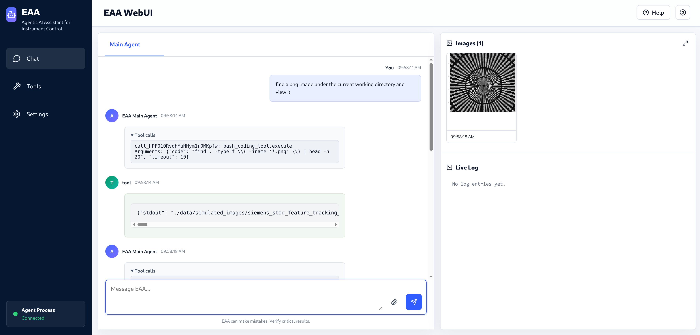

# Experiment Automation Agents (EAA)

EAA is a Python toolkit for building experiment-facing agents around shared
task-manager, tool, memory, skill, and WebUI primitives. The repository is a
`uv` workspace with three installable packages:

- `eaa-core`: shared runtime, generic tools, memory, WebUI, MCP helpers, and
  reusable task-manager infrastructure
- `eaa-imaging`: microscopy and imaging task managers, tools, prompts, and
  skills
- `eaa-spectroscopy`: spectroscopy tools, acquisition functions, and XANES
  workflows

## Installation

### Option 1: `uv` Workspace Sync (recommended)

From the repository root:

```bash
uv sync --all-extras
source .venv/bin/activate
which python
```

`which python` should resolve to `.venv/bin/python`.

This installs the workspace members into the repository-local environment as
editable packages. Use `--all-extras` for local development so optional
dependencies needed by docs, memory, and workflow examples are not removed.

### Option 2: `pip`

```bash
python -m venv .venv
source .venv/bin/activate
pip install -e packages/eaa-core -e packages/eaa-imaging -e packages/eaa-spectroscopy
```

## Quick Start

The smallest useful chat agent is a `BaseTaskManager` with an LLM config and at
least one domain tool. The driver below also shows how to add skills, configure
long-term memory, customize the workspace file tool, launch the WebUI, and run
an interactive chat.

Save this as a script in the repository root and set `OPENAI_API_KEY` before
running it. Memory requires the `memory_chroma` extra, which is included by
`uv sync --all-extras`.

```python
import os
from pathlib import Path

from skimage import data

from eaa_core.api.llm_config import OpenAIConfig
from eaa_core.api.memory import MemoryManagerConfig
from eaa_core.gui.html import launch_html_webui_subprocess
from eaa_core.task_manager.base import BaseTaskManager
from eaa_core.tool.workspace import FileSystemTool
from eaa_imaging.tool.imaging.acquisition import SimulatedAcquireImage


PROJECT_ROOT = Path(__file__).resolve().parent
RUNTIME_URL = "http://127.0.0.1:8010"


def main() -> None:
    llm_config = OpenAIConfig(
        model="gpt-4o-mini",
        base_url="https://api.openai.com/v1",
        api_key=os.environ["OPENAI_API_KEY"],
    )
    memory_config = MemoryManagerConfig(
        enabled=True,
        persist_directory=str(PROJECT_ROOT / ".eaa_memory"),
        namespace="quick-start",
    )
    skill_dirs = [
        str(PROJECT_ROOT / "packages/eaa-core/src/eaa_core/skills"),
        str(PROJECT_ROOT / "packages/eaa-imaging/src/eaa_imaging/skills"),
    ]
    acquisition_tool = SimulatedAcquireImage(
        whole_image=data.camera(),
        add_axis_ticks=True,
    )
    workspace_tool = FileSystemTool(
        workspace_path=str(PROJECT_ROOT),
        read_whitelist_paths=skill_dirs,
    )

    task_manager = BaseTaskManager(
        llm_config=llm_config,
        memory_config=memory_config,
        tools=[acquisition_tool, workspace_tool],
        skill_dirs=skill_dirs,
        checkpoint_db_path=str(PROJECT_ROOT / "checkpoint.sqlite"),
        transcript_db_path=str(PROJECT_ROOT / "transcript.sqlite"),
        use_webui=True,
        webui_runtime_host="127.0.0.1",
        webui_runtime_port=8010,
    )
    task_manager.tool_manager.set_coding_tool_request_approval(True)

    task_manager.start_webui_runtime()
    webui_process = launch_html_webui_subprocess(
        RUNTIME_URL,
        host="127.0.0.1",
        port=8008,
        title="EAA Quick Start",
    )
    print("WebUI: http://127.0.0.1:8008")
    try:
        task_manager.run_conversation()
    finally:
        webui_process.terminate()
        task_manager.stop_webui_runtime()


if __name__ == "__main__":
    main()
```

For terminal-only use, set `use_webui=False` and remove the
`start_webui_runtime()` and `launch_html_webui_subprocess()` calls.

In chat, useful commands include:

- `/skill` to list discovered skills
- `/skill <name>` to load one skill's `SKILL.md` into context
- `/setcodingtoolapproval true|false` to toggle approval for Python and Bash
  coding tools
- `/setcodingtoolsandboxtype none|bubblewrap|container [visible_dir ...]` to
  configure coding-tool sandboxing

## Architecture

- `LLMConfig` objects describe how the chat model is constructed. The shipped
  config classes are `OpenAIConfig`, `AskSageConfig`, and `ArgoConfig`.
- `BaseTaskManager` owns model invocation, tool registration, memory,
  persistence, WebUI runtime state, and graph execution.
- `SerialToolExecutor` runs tool calls one at a time. This is intentional:
  many experiment tools are stateful, mutate instrument state, or are not
  thread-safe.
- `MemoryManager` adds optional long-term memory retrieval and saving on chat
  turns.
- The WebUI server proxies browser requests to the task-manager-owned runtime
  API. Checkpoints and durable transcript display are stored in separate
  SQLite databases by default.

## Built-In Graphs and Workflows

The base runtime ships `chat_graph` for interactive conversation.

`build_task_graph()` is available as a subclass hook for custom LangGraph
workflows. Many task managers in this repository either reuse
`run_conversation()` or orchestrate analytical workflows directly in Python
while still updating message history and WebUI state through task-manager
helpers.

## WebUI and Checkpointing

The WebUI provides a browser chat interface for agent runs, including image
display, logs, and tool inspection.



Set `use_webui=True`, configure checkpoint and transcript paths, then start the
agent-side runtime server. Launch the browser-facing WebUI against the runtime
URL:

```python
from eaa_core.gui.html import launch_html_webui_subprocess

task_manager = BaseTaskManager(
    ...,
    checkpoint_db_path="checkpoint.sqlite",
    transcript_db_path="transcript.sqlite",
    use_webui=True,
    webui_runtime_port=8010,
)

task_manager.start_webui_runtime()
webui_process = launch_html_webui_subprocess(
    "http://127.0.0.1:8010",
    host="127.0.0.1",
    port=8008,
)

try:
    task_manager.run_conversation()
finally:
    webui_process.terminate()
    task_manager.stop_webui_runtime()
```

The base task manager exposes:

- `run_conversation_from_checkpoint()` for the chat graph
- `run_from_checkpoint()` for subclasses that implement `task_graph`

`checkpoint_db_path` stores LangGraph checkpoints. `transcript_db_path` stores
durable transcript display messages. `session_db_path` is no longer supported.

## Long-Term Memory

Long-term memory is configured with `MemoryManagerConfig`. In the current
codebase, the built-in memory manager creates a Chroma-backed vector store and
can:

- retrieve relevant memories on chat turns
- inject retrieved memories back into the model context
- save new memories when a user message contains trigger phrases such as
  `"remember this"` or `"keep in mind"`

Install the `memory_chroma` extra, or use `uv sync --all-extras`, before using
the built-in Chroma memory path.

## MCP Integration

EAA supports both directions of MCP integration.

Expose EAA tools as an MCP server:

```python
from eaa_core.tool.example_calculator import CalculatorTool
from eaa_core.tool.mcp_server import run_mcp_server_from_tools

run_mcp_server_from_tools(
    tools=CalculatorTool(),
    server_name="Calculator MCP Server",
)
```

Use an external MCP server as a normal EAA tool:

```python
from eaa_core.tool.mcp_client import MCPTool

mcp_tool = MCPTool(
    {
        "mcpServers": {
            "remote_tools": {
                "command": "python",
                "args": ["./path/to/server.py"],
            }
        }
    }
)
```

Use an MCP server over HTTP from another machine:

```python
from eaa_core.tool.mcp_client import MCPTool

mcp_tool = MCPTool(
    {
        "mcpServers": {
            "calculator": {
                "url": "http://SERVER_IP:8050/mcp",
                "transport": "http",
            }
        }
    }
)
```

For this remote HTTP setup, the server side must be started with
`run_mcp_server_from_tools(..., transport="http", host="0.0.0.0", port=8050, path="/mcp")`.
The client config must keep the server definition under `mcpServers`; passing
only `{"url": ..., "transport": "http"}` is not enough.

## Skills

Skills are reusable, markdown-first task packages that EAA can discover and
load at runtime. Each skill is a directory with at least a `SKILL.md` file.
Additional files can live alongside it for the agent to inspect with filesystem
tools when needed.

Bundled skills live under `packages/eaa-core/src/eaa_core/skills/` and
`packages/eaa-imaging/src/eaa_imaging/skills/`. A typical layout looks like:

```text
my-skill/
  SKILL.md
  references/
    api_reference.md
    figure.png
```

To use skills, point a task manager at one or more skill directories:

```python
task_manager = BaseTaskManager(
    llm_config=llm_config,
    tools=[acquisition_tool],
    skill_dirs=[
        "./packages/eaa-core/src/eaa_core/skills",
        "./packages/eaa-imaging/src/eaa_imaging/skills",
        "~/.eaa_skills",
    ],
)
```

At build time, EAA scans the configured directories for `SKILL.md` files and
injects skill names, descriptions, and `SKILL.md` paths into the system prompt.

You can also create your own skill directory, such as `~/.eaa_skills`, and add
it to `skill_dirs` alongside the bundled package directories.

## Documentation

Documentation lives under `docs/` and is built with Material for MkDocs. Build
it locally with:

```bash
uv run --extra docs mkdocs build --strict
```

The generated site is written to `site/`. The GitHub Actions workflow in
`.github/workflows/docs.yml` publishes it to
`https://advancedphotonsource.github.io/EAA/`.
