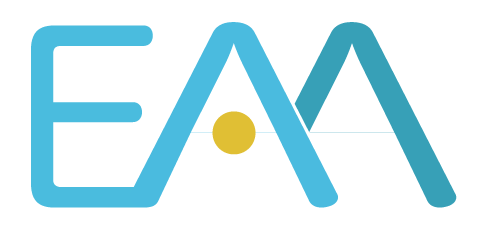

# Experiment Automation Agents

EAA is a runtime and harness for agents and workflows, designed for running scientific experiments especially for those needing vision. EAA turns a multimodal LLM into an experiment operator with features including the following:
- A built-in LLM chat loop
- An image-followup mechanism allowing LLMs to "see" images yielded by tools, even if the LLM provider's API doesn't allow images in tool responses
- Automatic image captioning
- Support of MCP servers and external HTTP endpoints as tools
- Support of agent skills
- Built-in tools including
  - File read/write
  - Python/bash coding (including Bubblewrap sandboxing)
  - Local environment setup with `uv`
  - Image rendering tool allowing LLM to see floating point TIFFs
  - Subagent and sub-task manager spawning
- Fully customizable "task manager" data structure
- A WebUI for easy interaction and visualization of sessions

**EAA is not only for LLM agents!** Fully logic-driven or rule-based workflows - such as Bayesian optimization - can be packaged as task managers. Use MCP servers as RPC calls through the built-in MCP-RPC wrapper, and display status and progress using the same WebUI. Logic-driven task managers can be added to the sub-task manager tool so that an LLM agent can launch them.

Start with the [quick start](quick-start.md), or use the [guide](guide.md) for
installation, configuration, tools, skills, memory, and WebUI usage.
